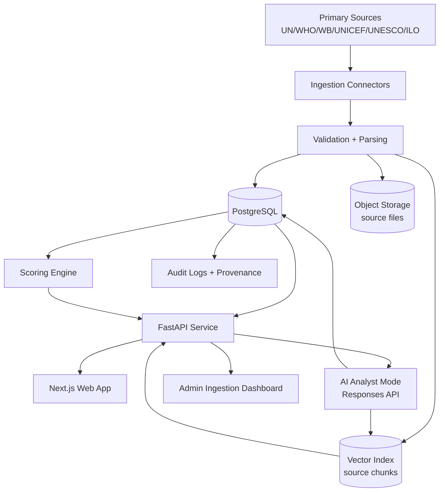

# System Architecture

## Mermaid Diagram

## Components
- **apps/web**: Next.js dashboard, country detail, source explorer, explainability, scenario lab, admin.
- **apps/api**: FastAPI endpoints for scores, sources, ingestion status, retrieval QA.
- **packages/data-model**: canonical schemas and SQL definitions.
- **packages/ingestion**: adapter contracts and provider-specific connectors.
- **packages/scoring**: deterministic score calculations + confidence model.
- **packages/ai**: retrieval-grounded answer orchestration for GPT-5.4 Responses API.
- **tests**: scoring and citation-integrity tests.
