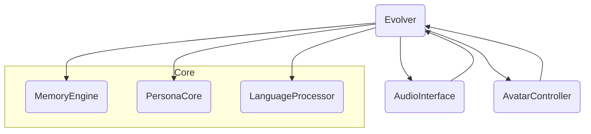

# Re:Ai Framework Overview

This document outlines the high level structure for the `Re:Ai` VTuber system. The goal is to provide a starting point for implementing a persistent and self-evolving virtual character.

## Directory Structure

```
reai/
    __init__.py
    memory_engine.py
    persona_core.py
    interface_audio.py
    vision_avatar.py
    lang_processor.py
    evolver.py
```

Each module is designed to be loosely coupled so implementations can be swapped or extended.

## Module Responsibilities

- **memory_engine.py** – interfaces with databases or vector stores to persist conversations and retrieve memories.
- **persona_core.py** – tracks mutable persona traits and updates them from feedback loops.
- **interface_audio.py** – handles speech-to-text and text-to-speech interactions.
- **vision_avatar.py** – connects the dialogue system with a 3D avatar via WebGL or Unity.
- **lang_processor.py** – wraps GPT-4 style APIs for prompt generation and response parsing.
- **evolver.py** – orchestrates the modules above and applies self-improvement logic.

## Dependency Diagram



The `Evolver` is the central coordinator that interacts with memory, persona, language, and I/O layers.

## Basic API Example

```python
from reai.evolver import Evolver

bot = Evolver()
response = bot.handle_user_input("Hello")
print(response)
```
