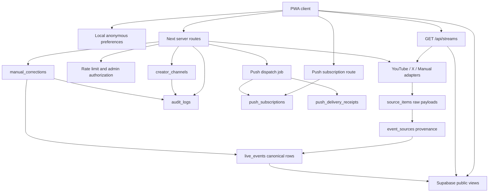

# Architecture and Data Flow

## Runtime Shape

## Key Rules

- Store canonical times in UTC.
- Define Today in the user-selected IANA timezone.
- Preserve source text. Do not replace originals with translations.
- App-owned UI strings must live in the reference catalogs. `pnpm verify:i18n` blocks ja/en key drift and direct JSX-owned UI text, while runtime locale utilities handle BCP 47 fallback, direction, numbers, plurals, and sorting.
- YouTube controls video identity, live/ended state, and video URL when present. If a matching YouTube row arrives after an X/manual announcement, canonical identity is promoted to the YouTube provider ID while preserving earlier provenance.
- Public YouTube ingestion uses `search.list` for live/upcoming discovery, then `videos.list` for batched `snippet`, `liveStreamingDetails`, and `status`.
- Direct X context uses official Recent Search only. It requests `tweet.fields=author_id` and `expansions=author_id`; posts are attributed only when the returned `author_id` maps to `includes.users.username` for a configured handle. Text mentions or batch ordering are never used as author fallback. X can provide announcements, cancellation/postponement context, URLs, relative dates, TBD wording, and collaborators; it does not invent live state. Plain X `unverified` context does not override a YouTube scheduled/live/ended state unless the post has explicit cancellation/TBD evidence.
- Runtime network reads stay inside the official provider API boundary: YouTube Data API, official X API, optional server-only OpenAI Responses API, and first-party app APIs. YouTube/X page URLs are shown as attributed source links, not scraped.
- The app does not ship, download, proxy, iframe, or rehost video, audio, thumbnail, logo, or character-art assets. Current UI is links-only; any future playback/embed surface requires a separate policy review and new trust-boundary tests.
- Announcement parsing uses deterministic rules first. Optional AI fallback is server-only, disabled by default, and may only merge candidates whose evidence quote appears in the source text.
- Admin corrections win, but require `manual_corrections` and `audit_logs`.
- Corrected `live_events` fields are recorded in `admin_corrected_fields`; later ingestion preserves those fields rather than silently overwriting admin-reviewed values.
- Alert candidates are derived from explicit preferences, enabled alert types, source state, confidence, and stale checks. Stale, TBD, unverified, or low-confidence items stay visible for review instead of being marked push-ready.
- Push dispatch never exposes raw endpoints in job responses; endpoint hashes and delivery receipts provide observability and duplicate suppression.
- Cross-provider dedupe is conservative: provider ID/any incoming source URL first, then constrained talent-time-title similarity.
- Duplicate evidence is merged into one canonical stream by preserving source links, provenance, collaborators, provider errors, and visible conflict IDs. Ambiguous merges become conflicts, not silent overwrites.

## Tables

- `branches`: branch taxonomy, locale hints, coverage status, and operator notes.
- `creator_channels`: branch FK, provider IDs, tags, aliases, confidence.
- `live_events`: canonical public event state, public-safe collaborators, conflict IDs, and provider error summaries.
- `source_items`: provider/manual evidence records with source payload excerpts, admin/server-only.
- `event_sources`: provenance join and field ownership.
- `public_event_links`: safe public source-link projection without raw payload JSON.
- `ingestion_runs`: job observability, quota, cursor state.
- `provider_errors`: retry/backoff, transient/permanent errors.
- `push_subscriptions`: opt-in Web Push endpoints, endpoint keys, alert-type toggles, and anonymous favorite preferences.
- `push_delivery_receipts`: per-subscription notification keys, payload hashes, status, and provider errors for idempotent dispatch.
- `manual_corrections`: admin correction trail.
- `audit_logs`: append-only administrative audit.

## Read Models

Anonymous users should read only:

- `public_creator_channels`
- `branches`
- `public_live_events`
- `public_event_links`
- `GET /api/streams`, which is read-only, rate-limited, and labels demo/degraded coverage. When `STREAMS_READ_SOURCE=supabase` is selected, the route reads only the public Supabase read model and returns an explicit degraded or empty state instead of falling back to provider adapters.

The public read views are created with `security_invoker = true`, so anon/authenticated callers use their own table privileges and RLS policies instead of a privileged view owner. The migration grants only the columns required by those views and the `public_event_links` visibility policy; public `live_events` columns include source-facing collaborators, conflict IDs, and bounded provider error summaries, while raw payloads, endpoint keys, IPs, user agents, audit details, and admin-only tables remain closed to public roles. `pnpm verify:rls` statically locks this boundary into the normal verification chain.

Offline support is split deliberately: the Service Worker caches the public app shell, safe public navigation routes, manifest, icon, and static Next assets, while bypassing `/api/*`, `/admin`, job, session, ingestion, and Push write routes. Stream data is stored by the client only after a successful `/api/streams` read as an offline snapshot in local storage. When the app cannot reach the network and uses that offline snapshot, source health is downgraded to stale and the UI labels the state as `offline_cache`. Locale and timezone remain local-first, but the client mirrors only those two display settings into a small first-party cookie so the server layout can render the next visit with the correct `lang`, `dir`, localized metadata, and initial display timezone. `pnpm verify:pwa` statically locks the manifest metadata, cache allowlist, cache denylist, and stale snapshot path; `pnpm test:pwa` runs a real Service Worker smoke on an isolated production server to confirm offline app-shell launch and no API replay from Cache Storage.

All public, admin, and job API routes use the shared request limiter. Limits are partitioned by client IP from proxy headers when present, and throttled responses include `Retry-After` plus `RateLimit-Policy`/`RateLimit`/`RateLimit-Backend` fields following the current IETF HTTPAPI draft shape. Local demo mode can use the bounded process-local memory fallback. Production must either set `RATE_LIMIT_BACKEND=supabase`, which calls the service-role-only `check_api_rate_limit` RPC with salted hashed bucket keys, or set `HOST_RATE_LIMIT_CONFIGURED=true` only after host/edge throttling is configured and published. The strict production config validator blocks process-local memory as the only public-production limiter.

Client code must not write ingestion tables. Production writes should go through server routes or narrow RPCs with explicit RBAC checks. Server routes accept the signed admin cookie or `ADMIN_JOB_TOKEN` for local operations, `CRON_SECRET` for Vercel scheduled job hits, and Supabase Auth bearer tokens by verifying the JWT with Supabase Auth and checking the user in `admin_members`. Browser-based Supabase admin login exchanges a verified access token through `/api/admin/supabase-session` for an app-owned HTTP-only admin account cookie, so the browser does not need to store the access token for later admin requests.

## Write Paths

- Manual import in the Admin UI is local-only and explicitly labeled.
- `GET /api/admin/creator-channels` reads demo registry rows without admin auth and reads configured Supabase creator/provider rows only for an admin session, Supabase admin account session, `ADMIN_JOB_TOKEN`, or a Supabase Auth bearer token whose user belongs to `admin_members`. `POST /api/admin/creator-channels` requires write-capable admin auth, validates branch, provider IDs, handles, aliases, tags, confidence, and active state, then calls the service-role-only `upsert_creator_channel_registry` RPC. The RPC upserts `creator_channels` and writes `audit_logs` as one database function so audit failure cannot leave an unaudited registry change. The database stores `branches` as the canonical branch registry, uses branch FKs from creator/event rows, validates provider ID format by provider, and rejects active YouTube/X rows on manual-only/future branches.
- `POST /api/admin/corrections` requires write-capable admin auth, validates the target canonical event, field, value, and reason, then calls the `apply_manual_correction` RPC. The RPC locks the target event row, updates `live_events`, appends `manual_corrections`, and writes `audit_logs` as one database function. Supabase Auth callers persist `admin_user_id` and `actor_user_id`; static token and session callers are labeled as token/session actors. If Supabase credentials are missing it returns a degraded response rather than pretending the correction was persisted.
- `GET /api/admin/ingestion-runs` requires admin auth when protection is configured, then reads recent `ingestion_runs` and joined `provider_errors` through the Supabase service role. In local demo mode it returns labeled fixture history.
- `GET /api/admin/audit-logs` requires admin auth when protection is configured, then reads recent `audit_logs` through the Supabase service role. In local demo mode it returns labeled audit examples for ingestion persistence, registry upserts, and manual corrections.
- `POST /api/ingestion/run` defaults to dry-run. `?persist=1` requires write-capable admin auth through `ADMIN_JOB_TOKEN`, the admin session cookie, or a Supabase Auth bearer token for an `admin_members` owner/admin user. Persistence calls the service-role-only `persist_ingestion_run(jsonb)` RPC, which sets a short statement timeout, takes a transaction-level advisory lock, upserts `live_events` and `source_items`, reconciles stale `event_sources` and `public_event_links` only when the trusted server payload explicitly opts into edge reconciliation, inserts `ingestion_runs` and `provider_errors`, and writes an `audit_logs` row in one database function. Admin-corrected fields remain guarded inside the upsert so provider refreshes cannot silently erase corrections.
- `GET /api/jobs/ingest` requires explicit `Authorization: Bearer <ADMIN_JOB_TOKEN>` for manual operations or `Authorization: Bearer <CRON_SECRET>` for Vercel Cron, and persists through the same `persist_ingestion_run` RPC unless `dryRun=1`. Browser admin cookies are intentionally not accepted for scheduled jobs.
- `GET /api/jobs/alerts` requires explicit `Authorization: Bearer <ADMIN_JOB_TOKEN>` for manual operations or `Authorization: Bearer <CRON_SECRET>` for Vercel Cron. `?dryRun=1&demo=1` previews dispatch candidates with demo fixtures and no Push send. Live dispatch requires VAPID keys, `VAPID_SUBJECT`, Supabase service credentials, and active subscriptions.
- `POST /api/push/subscribe` stores an opt-in browser subscription only when VAPID and Supabase service credentials are configured; re-subscribe clears prior deactivation metadata. `DELETE /api/push/subscribe` accepts an endpoint and soft-deactivates the matching active row with a user-unsubscribe reason when Supabase is available. The client runs browser `unsubscribe()` independently from server cleanup so local delivery stops even when cleanup is degraded.

Push subscription lifecycle is soft-deactivated rather than hard-deleted. User unsubscribe records `user_unsubscribe`; terminal push-provider responses record `push_404` or `push_410`; re-subscribe by the same endpoint reactivates the row and clears the reason. Dispatch metrics count a deactivation only when an active row changed to inactive, then skip remaining notifications for that subscription during the same run. The Service Worker currently handles push delivery and notification clicks, while subscription refresh/change automation is intentionally deferred until account sync or a background re-subscribe policy exists.

Provider adapters retry transient network/server failures once when no provider backoff time is supplied. When YouTube or X returns `Retry-After`, X returns an `x-rate-limit-reset` timestamp, YouTube reports quota/rate-limit exhaustion, or an X success response reports zero remaining requests, the adapter records `retryAfterUtc` in `provider_errors` and stops the remaining requests for that provider run. This keeps quota and platform backoff instructions visible to operators and avoids spending additional YouTube `search.list` units or X recent-search requests inside the reset window.

YouTube API source payload retention is enforced through `purge_stale_source_items` and `/api/jobs/retention`. The job defaults to `YOUTUBE_API_DATA_RETENTION_DAYS=29`, supports dry-run counts, deletes stale `event_sources` edges before stale `source_items`, and writes a `source_items.retention_purge` audit row. Normalized public schedule rows and source links remain visible with confidence/stale context; raw source payloads and detailed evidence age out.
- Before live API reads, `/api/streams`, `/api/ingestion/run`, `/api/jobs/ingest`, and `/api/jobs/alerts` read active transient `provider_errors.retry_after_at` rows through the service role. A provider still in cooldown is skipped with `requestCount: 0`, `quotaCost: 0`, a `provider_cooldown` error, and stale source health instead of spending provider quota before the reset window.
- `/admin` is protected by `ADMIN_JOB_TOKEN` in configured environments. The token is exchanged for an HTTP-only cookie through `/api/admin/session`; Supabase Auth admin accounts are exchanged for a signed HTTP-only account cookie through `/api/admin/supabase-session`. API integrations can use Supabase Auth bearer tokens for `admin_members` users without exposing the service-role key to the browser. Scheduled Vercel jobs use `CRON_SECRET` only for job routes and do not unlock the browser admin UI.
